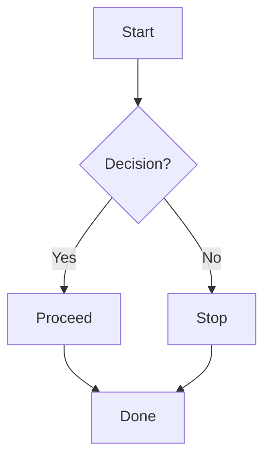

# Sample Markdown Document

A short paragraph with **bold**, *italic*, and ~~strikethrough~~.  
Inline code: `npm run build`. A [link to Markdown guide](https://www.markdownguide.org).

> Blockquote line 1  
> Blockquote line 2 with **bold**.

## Lists

- Unordered item
  - Nested item
- Another item

1. Ordered item
2. Second item
   1. Nested ordered item
3. Third item

- [x] Completed task
- [ ] Pending task

## Code

Inline: `console.log("hello");`

Fenced code:

```js
function greet(name) {
  console.log(`Hello, ${name}!`);
}
greet("World");
```

## Table

| Feature   | Supported | Notes                   |
|-----------|-----------|-------------------------|
| Bold      | Yes       | Use `**text**`          |
| Italic    | Yes       | Use `*text*`            |
| Code      | Yes       | Inline and fenced       |
| Mermaid   | Yes       | See diagram below       |

## Image


## Mermaid Diagram



## Task List Example

- [x] Write draft
- [x] Add diagram
- [ ] Proofread
- [ ] Publish

## Footnotes

Here is a statement with a footnote.[^1]

[^1]: Footnote text goes here.

## Horizontal Rule

---
